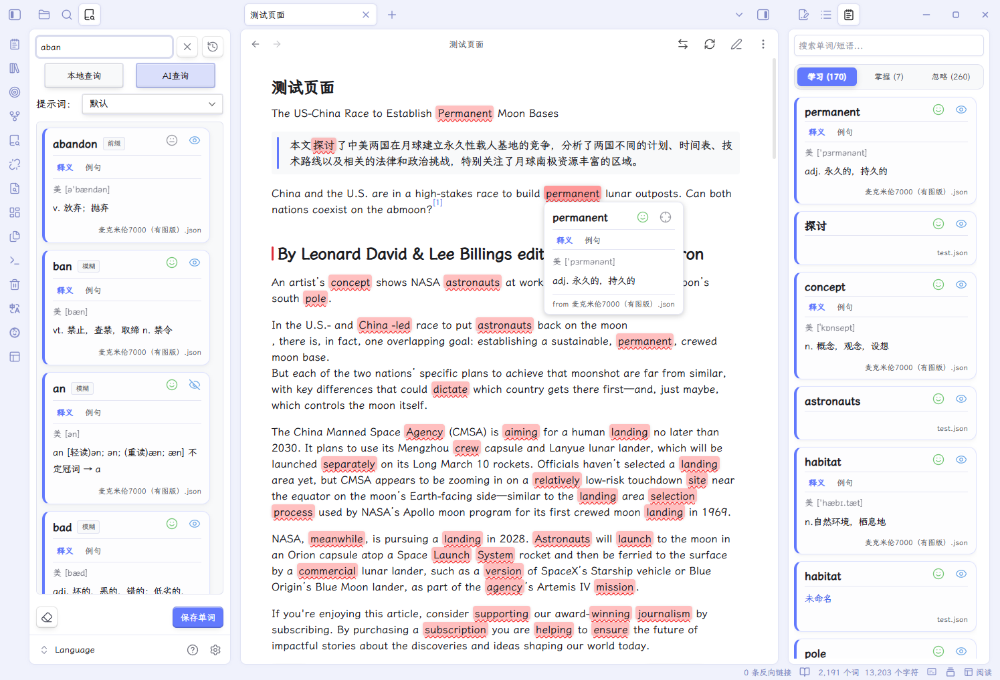
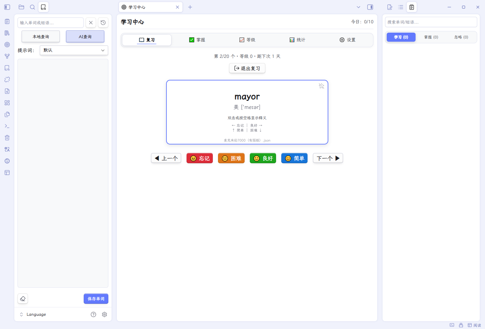
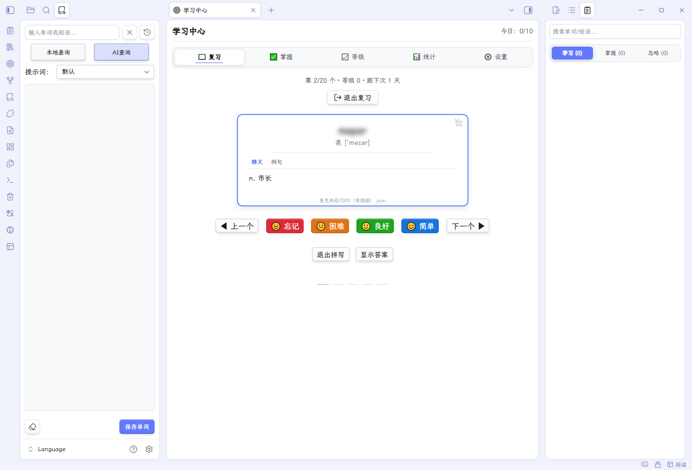
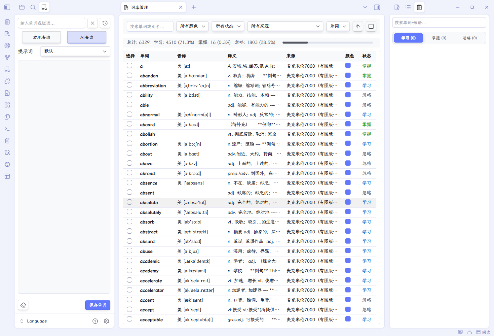

# Simple Wordbook

[简体中文](./README-ZH.md) | English


> 📦 **Plugin ID**: `simple-wordbook`  
> 💡 **Inspired by**: [obsidian-language-learner](https://github.com/guopenghui/obsidian-language-learner) and [HiWords](https://github.com/CatMuse/HiWords)

---

## 📖 Overview

**Simple Wordbook** is a word/phrase highlighting and learning management plugin for [Obsidian](https://obsidian.md/).  
It automatically highlights words from your custom wordbooks in your notes, and provides a complete learning toolkit including a sidebar, lookup panel, library management, study center, mastery tracking, AI-assisted lookup, TTS pronunciation, and import/export.

---

## ✨ Features

| Module                      | Capability                                                                                       |
| --------------------------- | ------------------------------------------------------------------------------------------------ |
| 📚 Wordbook File Management | Multiple `.json` wordbooks, enable/disable, read-only, drag-to-reorder, auto-follow on file move |
| 🎯 Auto Highlight           | Highlights in Reading / Editing / PDF, with alias matching and path scope filtering              |
| 📖 Word Sidebar             | Scans the current document, shows word cards by "Learning / Mastered / Ignored"                  |
| 🔍 Lookup Panel             | Local lookup + AI lookup, with history and prompt switching                                      |
| 🗂️ Library View            | Tabular browsing of all words, search, filter, sort, batch operations                            |
| 🧠 Study Center             | Review, mastered, levels, stats, settings, built-in simplified SM-2 algorithm                    |
| 🔊 Pronunciation            | Network TTS + System TTS, multi-language                                                         |
| 🤖 AI Configuration         | Multiple providers, encrypted keys, built-in/custom system prompts                               |
| 📤 Import & Export          | Import mastered/ignored from TXT; export Markdown, Anki TSV, single card                         |
| ⌨️ Commands & Hotkeys       | Dynamically generated prompt commands, free hotkey binding                                       |


---

## 🚀 Installation

### From the Obsidian Community Plugin Market (Recommended)

1. Open Obsidian Settings → Community plugins → Browse.
2. Search for `Simple Wordbook`.
3. Click **Install**.
4. Enable it in the installed plugins list.

### Manual Installation

1. Download `main.js`, `manifest.json`, `styles.css`.
2. Place them into `.obsidian/plugins/simple-wordbook/` in your vault.
3. Enable the plugin in Obsidian Settings.

### Install via BRAT (Recommended for Beta)

1. Install and enable the [BRAT](https://obsidian.md/plugins?id=obsidian42-brat) plugin.
2. In BRAT settings, click **Add Beta Plugin**.
3. Enter the repo URL: `https://github.com/Bin-T/obsidian-simple-wordbook`.
4. Click **Add Plugin**, then enable it in the community plugins list.

---

## 🎮 Usage Guide

### 1. Add a Wordbook

1. Create a blank `.json` file in your vault, or import a `.json` wordbook in the following format (a JSON array where each word object requires a `word` field and optionally `aliases`, `definition`, `phonetic`, `color`, `lang`, etc.):

```json
[
  {
    "word": "abandon",
    "aliases": ["abandoned", "abandoning"],
    "phonetic": "UK /əˈbændən/ US /əˈbændən/",
    "definition": "**Definition**\ngive up, forsake\n\n---\n\n**Example**\nHe abandoned his car in the snow.",
    "color": "red",
    "lang": "en"
  }
]
```

2. Open **Settings → Simple Wordbook → Files**, click **"Add Wordbook"** to select an existing file, or click **"New Wordbook"** to create one.
3. The file appears in the list. You can enable/disable it via the toggle, or set it to read-only.

You can also download ready-made wordbooks from the [wordbook repository](https://github.com/Bin-T/obsidian-simple-wordbook/tree/main/wordbooks).

#### More about Wordbook Files

- Supports drag-to-reorder to adjust priority.
- Supports **Read-only Mode**, which prevents editing or deleting words in that wordbook.
- If a file is renamed or moved, the plugin automatically updates the wordbook path.
- Definitions support full Markdown, including tables, lists, internal links, etc.
- Use `---` to separate multiple tabs. The tab name is taken from the `**Title**` at the start of each section.
- If no title is set, the first section is named "Definition" by default, and subsequent sections are "Content 2", "Content 3", etc. (see FAQ).

### 2. Word Sidebar

- Click the Ribbon icon or use the command to open the Word Sidebar.
- It automatically shows word cards matched in the current document.
- Click **😊/😐** on a card to mark mastered/unmark.
- Click **👁/👁‍🗨** to mark ignored/unmark.
- Click a word to pronounce it (requires TTS configuration).
- For cards from non-read-only wordbooks, right-click to **Edit/Delete** the word or **Export as Markdown**.

#### Word Sidebar Cards

- Divided into three tabs: **"Learning / Mastered / Ignored"**, each showing its count.
- Card displays: word, phonetic, definition, source wordbook, color label.
- Card content area scrolls independently and supports multi-section tab switching.
- Supports search filtering; searching automatically switches to the first matching tab.
- Supports **Fold Definition** and **Blur Definition**.
- Click a word to pronounce; right-click the word to copy word, phonetic, definition, source, or all info.
- Right-click the card to edit, delete, or export as Markdown; read-only wordbooks cannot be edited/deleted.
- **Mastery/Ignore Mode** can be set to Global or Per-source.

### 3. Lookup Panel

- Click the Ribbon icon or use the command to open the Lookup Panel.
- Enter a word and click **"Local Lookup"** to search your wordbooks.
- Click **"AI Lookup"** to call the AI for detailed definitions.
- Switch prompts via the **"Prompt"** dropdown.
- Click **"Save Word"** to save the result into your wordbook.
- Local lookup result cards also support right-click **Edit**, **Delete**, and **Export as Markdown**.

#### Enter Mode

In **Settings → General → Lookup Panel → Enter Mode**, you can choose:

- **Local Only**: Enter searches only local wordbooks.
- **AI Only**: Enter goes directly to AI.
- **Local First**: Search local first, fall back to AI if not found.

> Tip: Press `Shift + Enter` in the input box to always force AI lookup.

#### Local Search Mode

In **Settings → General → Lookup Panel → Local Search Mode**, you can choose:

- **Smart (comprehensive ranking)**
- **Exact (exact match only)**
- **Prefix**
- **Contains**
- **Fuzzy (allow typos)**

#### Max Results

In **Settings → General → Lookup Panel → Max Results**, set the maximum number of results returned by local lookup (1–100).

#### Query History

- Click the **History** button on the right of the input box to open the history dropdown.
- Supports search, pin, and clear.
- AI lookup results are cached; clicking a history item restores the result directly.

### 4. Library Management

- Click the Ribbon icon or use the command to open Library Management.
- Top toolbar: search box, color filter, status filter, source filter, sort field, sort direction, select all.
- Table columns: Select, Word, Phonetic, Definition, Source, Color, Status.
- Double-click a row to edit; right-click a row to open the context menu.
- After selecting rows, the batch bar shows: Change Color, Mark Mastered, Unmark Mastered, Mark Ignored, Unmark Ignored, Delete Selected, Clear Selection.
- Top stats bar shows total, learning, mastered, ignored counts and ratios.

### 5. Study Center

- Click the Ribbon icon or use the command to open the Study Center.
- The top shows today's progress `Today: X/Y`.

#### Review Tab

- Choose a wordbook → view stats → click **"Let's do this! 💪"** to start reviewing.
- Card front: word, phonetic; double-click or press Space to flip.
- Card back: definition (supports multiple tabs, switch with number keys 1–9).
- Feedback buttons:
  - 2-button mode: **Forget (←) / Remember (→)**
  - 4-button mode: **Forget (←) / Hard (↓) / Good (→) / Easy (↑)**
- Other shortcuts:
  - `B`: bookmark / unbookmark (requires "Bookmark for Review" enabled)
  - `Alt + P`: pronounce the word
  - `Ctrl + ←/→`: previous / next
  - `R`: review bookmarked words together
  - `A`: one more round
  - `Q`: back to preparation

##### Smart Spell Check

When enabled, spell buttons appear on the card back:

- Click **"Spell (S)"** to enter spelling mode; type letter by letter into slots.
- **"Show Answer / Hide Answer"**: show a translucent hint; press `Alt + A` to toggle quickly.
- **"Exit Spelling"**: press `Alt + E` to exit quickly.
- **"Spell again (S)"**: restart in place after finishing a round.
- Wrong letters shake the slot; 3 wrong attempts auto-fill the correct letter in red.
- Supports multiple word masks: Blur / Hidden / Transparent / Placeholder / No Mask.
- Supports auto pronunciation before / after spelling.
- Supports custom error reset mode (per-slot / full reset) and slot placeholder.

#### Mastered Tab

- View all mastered words.
- Supports search.
- Can unmark mastery and restore learning.

#### Levels Tab

- View words by level (0–5), ease factor, review count.
- Supports search, level filter, type filter (Newbie / Steady / Efficient / Struggling / Stubborn), and sorting.
- Can mark / unmark mastery.

#### Stats Tab

- Top overview cards: total words, learning rate, mastered rate, ignored rate, today's progress, day streak.
- Donut chart: learning status distribution.
- Line chart: 30-day learning trend.
- Bar chart: level distribution.
- Lists: source distribution, color distribution.

#### Settings Tab

- Daily goal, daily review limit
- Auto flip (seconds)
- New word order (Sequential / Random)
- Review order (Due first / High level first / Low level first)
- Show phonetic, Show definition as tabs
- Fine feedback (4-button mode)
- Bookmark for review
- Smart spell check (mask, pronounce before/after, mask placeholder, error reset, slot placeholder)
- Review intervals (level 0–4, default 1/2/4/8/16 days)
- Advanced algorithm parameters (base ease delta, extra ease delta, reward threshold, ease range, suspend parameters, penalty threshold)

### 6. Right-click Menus

- **Select text in Editor**, right-click → **Add Word/Phrase** to quickly add a word.
- **Select text in Editor**, right-click → **Lookup: xxx** to open the Lookup Panel and search automatically (always uses AI).
- **Word Sidebar / Lookup Panel card**, right-click → **Edit** / **Delete** / **Export as Markdown**.
	- "Edit" and "Delete" only appear for cards in **non-read-only** wordbooks.
	- "Export as Markdown" is **always available**.
- **Word right-click copy menu**: copy word, phonetic, definition, source path, or all info.

### 7. Hover Preview

- Hover over any highlighted word to show a definition popup.
- The popup displays phonetic, full definition, and multiple sources.
- You can switch sources, mark mastery, or locate in the sidebar from within the popup.
- Supports **Blur Definition** mode (blurred by default, clear on hover).

### 8. Example Extraction & AI Context Explanation

When adding/editing a word, click the quote icon in the top-right of the definition box to open the example extractor:

- **Example extraction modes**:
	- By empty line: extract the full paragraph where the cursor is.
	- By line break: extract the current line where the cursor is.
	- By sentence boundary: intelligently detect `。！？.!?` and extract the sentence where the cursor is.
	- By list item: detect list markers and extract the list item where the cursor is.
- **AI Context Explanation**: call the AI to explain the word in the selected context, and insert it into the definition.
	- Supports custom system prompt and prompt content; prompts are saved automatically.

### 9. Import & Export

#### Import

- In **Settings → Files → Import**, click **"Import"** to select a `.txt` file.
- Supports importing a **mastered list** or **ignored list**.
- One word per line, or separated by `,` `，` `;` `；` `Tab`.
- Existing or conflicting words are skipped automatically (ignored takes priority over mastered).

#### Export Wordbook

In **Settings → Files → Export Wordbook**, open the export dialog:

- Select wordbooks to export (only enabled wordbooks are shown; multi-select allowed).
- Select range: All / Learning / Mastered / Ignored.
- Select format:
  - **Markdown `.md` **: good for reading/printing.
  - **Anki-compatible TXT (TSV)**: tab-separated, ready to import into Anki.
- Optional fields: phonetic, aliases, definition, source, status, lang.
- TXT format additionally supports:
  - **Convert to HTML**: convert Markdown bold and line breaks to `<b>` and `<br>`.
  - **One word per line**: no quotes, line breaks converted to spaces.
- Choose save folder and filename.

#### Export Mastered/Ignored

In **Settings → Files → Export Mastered / Export Ignored**, export as `.txt` with one word per line.

#### Export Single Card

Right-click a word card → **Export as Markdown** to export a single word card as a standalone `.md` file.

### 10. Highlight Configuration

In **Settings → General → Highlight & Preview**, you can adjust:

- Enable/disable auto highlight
- Enable/disable hover preview
- Blur definition
- Fold definition
- Enable/disable mastery/ignore buttons
- Highlight color: follow card color or custom
- Markdown highlight opacity: default 30%
- PDF highlight opacity: default 70%
- Underline style and color
- Bold
- Text color highlight mode (Markdown only)
- Highlight scope (path filter)

#### Highlight Scope

- When enabled, you can set **Include only** or **Exclude only** paths.
- One path per line:
  - Markdown files must include the `.md` extension.
  - A folder path matches all files under it.
  - Use `*` to match all files in the vault root (excluding subfolders).

### 11. Pronunciation Configuration

- Click a word to play its pronunciation.
- **Network TTS**:
  - Built-in presets: Youdao (English only), Baidu (multi-language), Google (multi-language).
  - Supports custom URL templates with `{{word}}`, `{{type}}`, `{{accent}}`, `{{lang}}`, `{{rate}}` placeholders.
  - Supports US / UK variant switching (only effective for templates using `{{type}}`).
  - Supports adjusting speech rate range per preset.
- **System TTS**:
  - Uses the browser/OS built-in speech synthesis engine, fully offline.
  - Can specify system voice, speech rate, pitch.
  - "Default" voice matches automatically based on the word's `lang` field; falls back to Network TTS if no match.
- **Multi-language Management**:
  - Add/edit/delete languages.
  - Configure the code used by each language under Google / Baidu / System / Custom presets.
  - Set the default pronunciation language.

---

## ⚙️ Configuration Details

### Files

| Item | Description |
|---|---|
| Wordbook Files | List of added wordbooks; enable/disable/delete/drag-to-reorder |
| Read-only Mode | When set, words in this wordbook cannot be edited or deleted |
| Mastery/Ignore Mode | Global or Per-source |
| Mastery/Ignore File Path | Custom storage path for mastery/ignore state files |
| Import | Import mastered or ignored lists from TXT |
| Export | Export wordbook (Markdown/Anki), export mastered/ignored lists |

### General

| Item | Description |
|---|---|
| Plugin Language | Auto / English / Simplified Chinese |
| Highlight & Preview | Highlight color, style, hover preview, blur/fold definition, mastery button toggle |
| Highlight Styles | Underline style, bold, underline color |
| Highlight Scope | Include/exclude files by path |
| Lookup Panel | Enter mode, local search mode, max results |

### Pronunciation

| Item | Description |
|---|---|
| Default Pronunciation Language | Used when a word has no `lang` field |
| Language Management | Add/edit/delete languages and configure preset codes |
| Network TTS | Preset (Youdao/Baidu/Google/Custom), URL template, variant, speech rate |
| System TTS | Enable toggle, voice selection, speech rate, pitch |
| Pronunciation Test | Enter a word to test the current Network TTS configuration |

### AI

| Item          | Description                                     |
| ------------ | -------------------------------------- |
| Service Provider        | OpenAI, DeepSeek, GLM (Zhipu), Tongyi Qianwen, Ollama, Custom |
| API URL/Key/Model | Auto-filled based on provider, manually editable |
| API Key Storage Mode   | Official Keychain / Local Encrypted (Vault-derived key) |
| Temperature           | 0–2, controls response randomness |
| Max Output Tokens   | 100–4000 |
| Built-in System Prompts | Default, Cute & Soft, Trendy & Cool, Daily Colloquial, Business Formal, Academic Solemn, Literary Aesthetic |
| Custom System Prompts | Add multiple; can be associated with custom prompts |
| Default Prompt        | Uses `{word}`, `{context}` placeholders |
| Custom Prompts       | Add multiple prompts, switchable in the Lookup Panel |
| Context Extraction Mode | By empty line / line break / sentence / list item |
| PDF Context Length    | 50–500 characters |
| Test Connection         | Verify current configuration |

### Study Center

| Item | Description |
|---|---|
| Daily Goal | Number of words to review per day |
| Daily Review Limit | Maximum words per review session |
| Review Order | Due first / High level first / Low level first |
| New Word Order | Sequential / Random |
| Auto Flip | 0 (off) / 1 / 2 / 3 / 5 seconds |
| Show Phonetic | Whether to show phonetic on the card |
| Definition as Tabs | Show multi-section definitions as tabs, switch with 1–9 |
| Fine Feedback | Show 4 feedback buttons |
| Bookmark for Review | Show bookmark button; can review bookmarked words together at the end |
| Smart Spell Check | Show spell button and input; supports multiple mask modes |
| Review Intervals | Base interval days for levels 0–4 |
| Advanced Algorithm Parameters | Base/extra ease delta, reward threshold, ease range, suspend parameters, penalty threshold |

---

## ⌨️ Commands & Hotkeys

In **Settings → Hotkeys**, you can bind hotkeys for the following commands:

| Command | Description |
| --- | --- |
| `Open Word Sidebar` | Activate the sidebar view |
| `Open Lookup Panel` | Open the Lookup Panel and focus the input |
| `Add Word/Phrase` | Open the add word modal |
| `Refresh Wordbook` | Reload all wordbooks and refresh highlights |
| `Open Settings` | Jump to the plugin settings page |
| `Open Library` | Open the Library view |
| `Open Study Center` | Open the Study Center view |
| `Speak selected text` | Use TTS to read the selected text |
| `Stop Reading` | Stop the current pronunciation |

**Dynamically generated commands**:

In `AI Configuration → Custom Prompts`, each custom prompt automatically generates an independent command:

| Command Format | Description |
| :--- | :--- |
| `Lookup with prompt: {prompt name}` | With text selected, run this command to perform AI lookup using the corresponding custom prompt |

- After adding/deleting/renaming prompts, the command list **auto-refreshes** without restarting Obsidian.
- **Hotkeys bind permanently**: as long as the prompt name is unchanged, bound hotkeys remain valid.
- Deleting a prompt removes its command; re-adding a prompt with the same name **restores the hotkey automatically**.

---

## 🗂️ Data Storage

| File | Path | Description |
|---|---|---|
| Wordbook Files | User-defined | `.json` format, can be placed anywhere in the vault |
| Mastery File | `.obsidian/plugins/simple-wordbook/_wordbook_mastery.json` | Stores mastered words; path customizable |
| Ignored File | `.obsidian/plugins/simple-wordbook/_wordbook_ignored.json` | Stores ignored words; path customizable |
| Study Progress File | `.obsidian/plugins/simple-wordbook/_wordbook_study.json` | Stores review records, daily stats, daily goal |
| Settings File | `.obsidian/plugins/simple-wordbook/data.json` | Plugin configuration, fixed in the plugin folder |

---

## ❓ FAQ

**Q: Highlighting doesn't work?**  
A: Check whether "Enable auto highlight" is on in Settings; check whether the wordbook is enabled; check whether the current file is within the "Highlight Scope".

**Q: The sidebar shows nothing?**  
A: Make sure the current document contains words from your wordbooks and that these words are not marked as "Ignored". If "Sidebar Scope Filter" is enabled, confirm the current file is within scope.

**Q: AI lookup fails?**  
A: Check the API URL, key, and model name, and network connectivity. You can use "Test Connection" in Settings to verify.

**Q: How to highlight in PDF?**  
A: PDF highlighting is supported by default. Ensure auto highlight is enabled and wait for the PDF to finish rendering.

**Q: Mastery state lost?**  
A: Check whether the "Mastery File" path is correct and writable. When switching mastery mode (Global/Per-source), the plugin migrates data automatically.

**Q: System TTS has no sound?**  
A: Check whether the OS has the corresponding language voice pack installed. If no match, the plugin falls back to Network TTS automatically.

**Q: How are the tabs in the hover preview / word card split?**  
A: 
1. The plugin uses `---` (three consecutive hyphens) as a separator to split the definition text into multiple sections, each of which becomes an independent tab.
2. It scans the **bold text at the start** of each section (`**bold text**`) and extracts it as the tab name.

**Example:** If you write the following in the definition box of the **Edit Word/Phrase** modal, it generates 3 tabs:

```text
**Definition**
give up, forsake; abandon

---

**Common Examples**
He abandoned his car in the snow.

---

**Related Phrases**
abandon hope
```

3. If a section does not start with `**Title**`, the plugin assigns default names:
   - The first section → default name `Definition`
   - Subsequent sections → default names `Content 2`, `Content 3`, ...

**Q: How to quickly bind hotkeys to custom prompts?**  
A: In `AI Configuration → Custom Prompts`, click the "Set Hotkeys" button to jump to the Obsidian Hotkeys settings page with this plugin's commands filtered automatically. You can bind an independent hotkey for each `Lookup with prompt: xxx` command for one-key lookup.

**Q: How does the Study Center review algorithm work?**  
A: The plugin uses a simplified SM-2 algorithm:
- Each word has a level from 0 to 5; reaching 5 means mastered.
- Each review adjusts the level and ease factor based on feedback (Forget/Hard/Good/Easy).
- Actual review interval = base interval (customizable by level) × ease factor.
- Consecutive Good/Easy feedback grants an extra ease reward; consecutive Forget/Hard triggers a suspend.
- Advanced parameters can be adjusted in "Study Center → Settings → Advanced Settings".

**Q: Can wordbook files be placed anywhere?**  
A: Yes. Wordbook files can be placed anywhere in the vault. If a file is renamed or moved, the plugin updates the path automatically.

---

## 🎨 Custom Styles (CSS Snippet)

You can override the plugin's default styles with a CSS snippet. The following example makes highlighted words inside sidebar cards follow the card color with 15% opacity (already built into the plugin, see `styles.css`):

```css
.word-card .simple-wordbook-highlight,
.word-card-content .simple-wordbook-highlight,
.lookup-result .word-card .simple-wordbook-highlight {
  background-color: color-mix(in srgb, var(--card-color) 15%, transparent);
  text-decoration: none;
  border-radius: 6px;
  padding: 0 2px;
}
```

For more customization, refer to the namespaces in the plugin's `styles.css`.

---

## 📸 Preview

### Lookup Panel & Word Sidebar



### Study Center




### Library Management



---

## 📄 Development Notes

> This plugin is developed with AI assistance, and all core features have been carefully tested and verified by the developer to ensure code quality, security, and stability.  
> If you encounter any issues, feel free to submit an Issue on the GitHub repository.

Repository: <https://github.com/Bin-T/obsidian-simple-wordbook>  
Wordbooks: <https://github.com/Bin-T/obsidian-simple-wordbook/tree/main/wordbooks>

---

## 📜 License

This project is licensed under the [MIT License](https://opensource.org/licenses/MIT). See the `LICENSE` file in the repository root.
